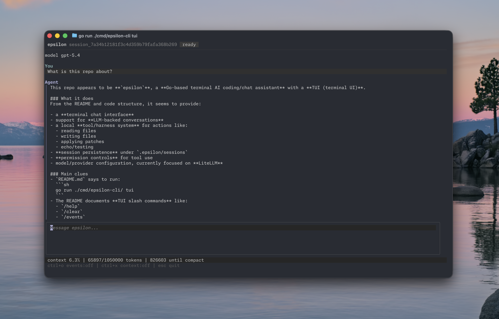

# epsilon

<p align="center">
  <a href="https://go.dev/"></a>
  
  
  
</p>

<p align="center">
  <strong>A small, sharp agent harness for terminal-native coding sessions.</strong>
</p>

<p align="center">
  <em>Epsilon: the fifth-brightest star in a galaxy.</em>
</p>

---

## What is epsilon?

epsilon is a Go-based harness and TUI for running agentic coding sessions from the terminal. It is built around a provider-neutral core, persistent sessions, local tools, slash commands, and a Bubble Tea interface that keeps the conversation, context, permissions, and model settings close at hand.

The project is still experimental, but the shape is intentionally practical: boot quickly, talk to a LiteLLM-compatible provider, let the model use local workspace tools, persist the event stream, and resume work later without ceremony.

<p align="center">
  
</p>

## Highlights

- Terminal-first chat interface with streaming assistant output.
- Provider-neutral harness core with a LiteLLM provider.
- Persistent JSONL session history.
- In-TUI session resume with a fuzzy session picker.
- In-TUI model picker backed by provider model metadata.
- Config defaults and session defaults stored in `.epsilon/config.json`.
- Cached provider model metadata to avoid repeated expensive discovery calls.
- Local workspace tools for reading, writing, grepping, patching, and echoing.
- Permission broker support for tool execution.
- Context window summary and model metadata display.
- Markdown rendering for assistant responses.

## Quickstart

LiteLLM is the primary provider path today.

```sh
export EPSILON_PROVIDER=litellm
export LITELLM_BASE_URL=https://your_litellm_url
export LITELLM_MODEL=gpt-5.4
export LITELLM_API_KEY=your_api_key
```

Start the TUI:

```sh
go run ./cmd/epsilon-cli tui
```

Run a one-shot prompt:

```sh
go run ./cmd/epsilon-cli run "read the README and summarize the project"
```

Resume a known session from the CLI:

```sh
go run ./cmd/epsilon-cli resume session_abc123 "continue from here"
```

## Configuration

epsilon reads harness configuration at boot from:

```text
.epsilon/config.json
```

Session defaults are updated as you change settings during a session, so model and effort changes can carry into following sessions. API keys are intentionally left out of persisted config; provide them through environment variables or flags.
epsilon has a prompt framework in `core/prompts` with named prompt definitions for the main agent, summary agents, and title agents. Default prompt text lives in embedded `.txt` files under `core/prompts/defaults`. The main agent prompt is injected by default. Additional system-prompt text can be supplied inline, from a file, through environment variables, or as persisted config; that text is appended to the default agent prompt without being duplicated into saved session history.

Useful flags:

```sh
-config .epsilon/config.json
-session-dir .epsilon/sessions
-workspace .
-provider fake|litellm
-litellm-base-url http://localhost:4000
-litellm-api-key <key>
-model <model>
-effort <effort>
-system-prompt "follow these harness instructions"
-system-prompt-file ./SYSTEM_PROMPT.md
```

## TUI slash commands

Slash commands run locally in the TUI and are not sent to the model. Use `//` to send a literal message that starts with `/`.

Type `/` in the composer to open the fuzzy command selector. Use up/down to move through matches and tab to complete the highlighted command.

| Command                                     | Description                                         |
| ------------------------------------------- | --------------------------------------------------- |
| `/help`                                     | Show available slash commands.                      |
| `/clear`                                    | Clear the visible transcript.                       |
| `/details [on\|off\|toggle]`                | Show or hide tool and event details.                |
| `/density [comfortable\|compact\|toggle]`   | Switch transcript density.                          |
| `/model [name]`                             | Pick a model from the provider or set one manually. |
| `/effort [minimal\|low\|medium\|high\|off]` | Show, set, or clear model effort.                   |
| `/resume [session-id]`                      | Pick or resume a persisted chat inside the TUI.     |
| `/status`                                   | Show session and TUI state.                         |
| `/exit`                                     | Quit epsilon.                                       |

## Project layout

```text
cmd/epsilon-cli/      CLI entrypoints
core/                 Harness, providers, sessions, tools, events
epsilon-cli/tui/      Bubble Tea terminal UI
assets/               README and UI assets
```

## Development

Run the full test suite:

```sh
go test ./...
```

The codebase favors small interfaces, append-only event history, and narrow provider adapters. The core package should stay usable outside the TUI, while the TUI owns interactive affordances like pickers, slash command presentation, and permission prompts.
